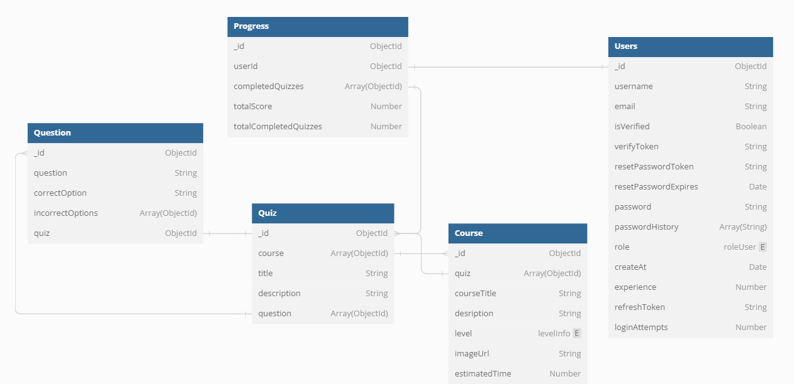
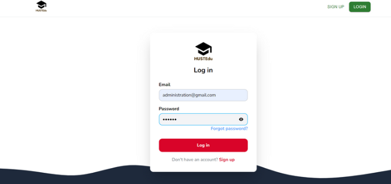
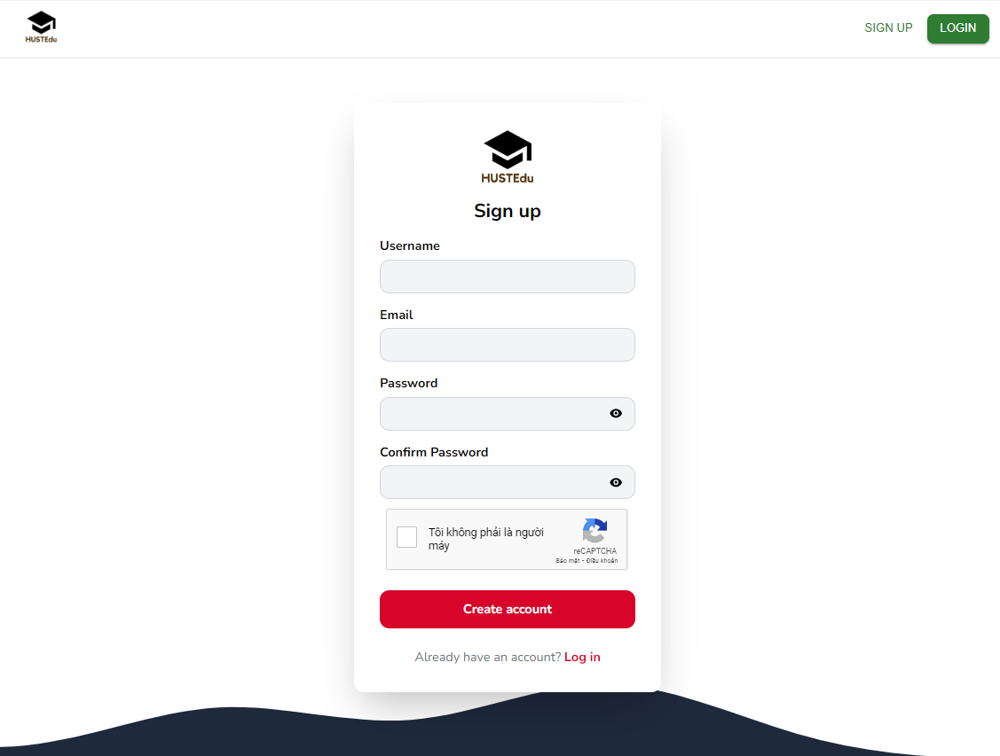
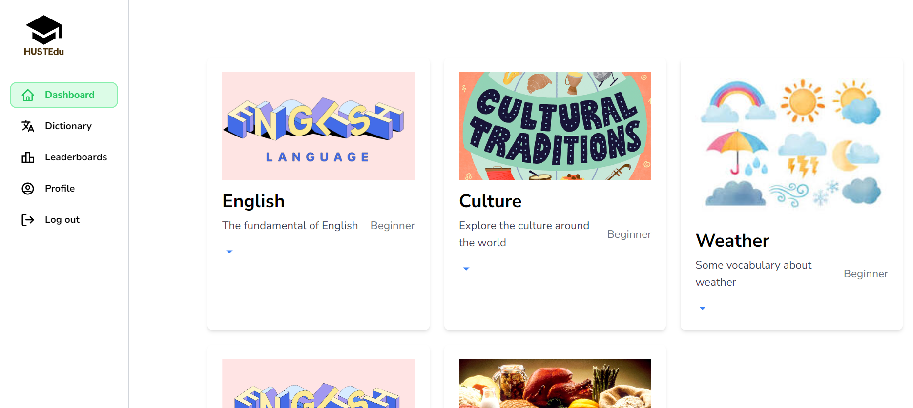
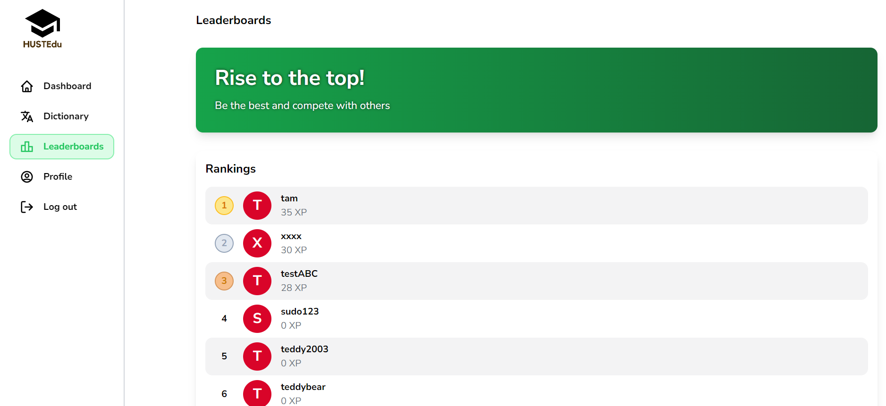
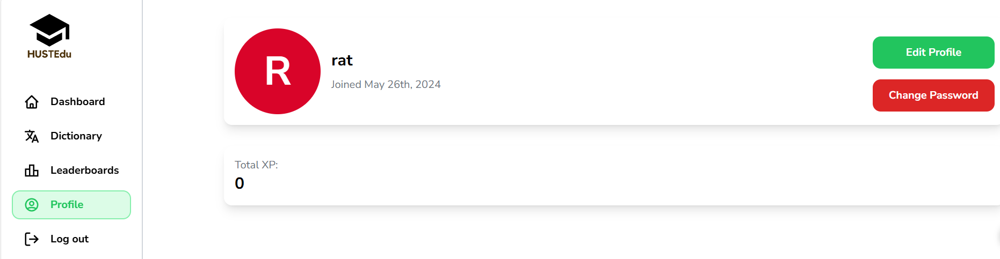
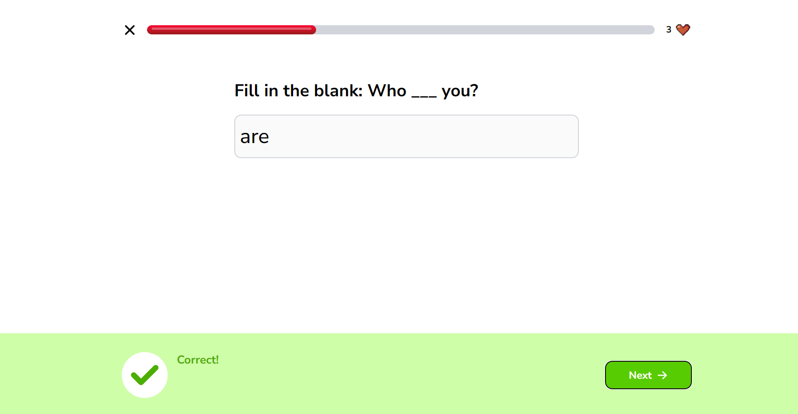
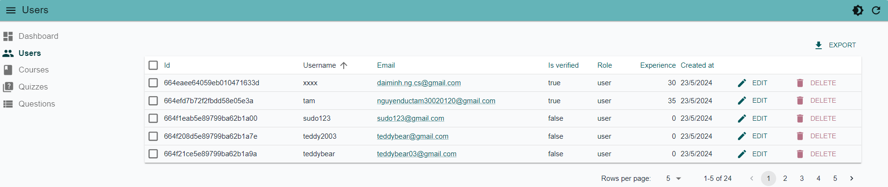

# Learning Language Website

This is a learning language website built using the MERN stack (MongoDB, Express.js, React, Node.js) and Firebase for image storage. It allows users to learn new languages through various interactive features.

## Database design

*Figure 1: Database Design*

## Features

- User Registration: Users can create an account by providing their email and password.
- User Authentication: Users can log in using their registered email and password.
- Forgot Password: Users can reset their password if they forget it.
- Change Password and User Information: Users can update their password and personal information.
- Leaderboard: A leaderboard feature tracks user performance and rankings.
- Quiz: Users can participate in interactive quizzes.
- Admin Panel: Administrators have access to an admin panel to manage user accounts and content.

## Screenshots

### Authentication Interface

  
  
  

### User Interface

*Figure 2: Browser Screen*

*Figure 3: Leaderboard Screen*

*Figure 4: Profile Screen*

*Figure 5: Quiz Screen*

### Admin Interface

*Figure 6: Admin Panel*

## Deploy
Demo: https://deploy-web-client.vercel.app/

